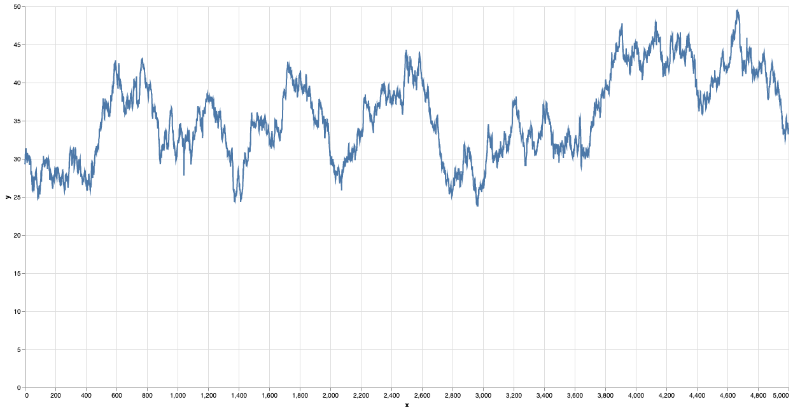
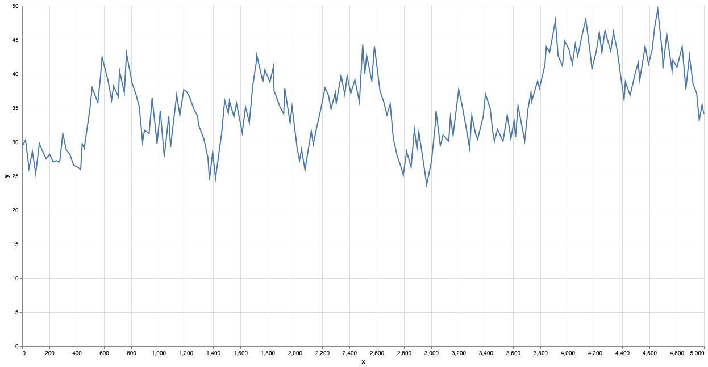

# clj-lttb

Largest-Triangle-Three-Buckets (LTTB) for Clojure. For more information, see the original implementation at https://github.com/sveinn-steinarsson/highcharts-downsample

## Example

The first dataset from https://github.com/sveinn-steinarsson/highcharts-downsample without downsampling (5000 points)

And sampled to 200 points

